

<h3>Cognevance Internship - Task 1</h3>

<h1>📊 Customer Churn Prediction</h1>

Predict telecom customer churn using <b>Machine Learning</b>.

🚀 Data Preprocessing • 📊 EDA • 🤖 ML Models • 📈 Evaluation • 💾 Prediction

<h2>✨ Project Overview</h2>

This project predicts whether a telecom customer is likely to churn using
multiple Machine Learning classification algorithms.

<h2>🛠️ Technologies</h2>

Python • Pandas • NumPy • Scikit-learn • Matplotlib • Seaborn • XGBoost

<h2>🤖 Models Used</h2>

<ul>
  <li>Logistic Regression ⭐</li>
  <li>Random Forest</li>
  <li>Decision Tree</li>
  <li>Support Vector Machine (SVM)</li>
  <li>K-Nearest Neighbors (KNN)</li>
  <li>XGBoost</li>
</ul>

<h2>🏆 Best Model</h2>

<table>
<tr>
<th>Model</th>
<th>ROC-AUC</th>
<th>Recall</th>
</tr>
<tr>
<td><b>Logistic Regression</b></td>
<td><b>0.8353</b></td>
<td><b>0.7941</b></td>
</tr>
</table>

<h2>📂 Project Structure</h2>

<pre>
Customer-Churn-Prediction/
│
├── dataset/
│   └── Telco-Customer-Churn.csv
│
├── notebooks/
│   └── Customer_Churn_Prediction.ipynb
│
├── src/
│   ├── preprocessing.py
│   ├── train.py
│   ├── evaluate.py
│   ├── predict.py
│   ├── utils.py
│   └── run_pipeline.py
│
├── model/
│   ├── best_model.pkl
│   ├── preprocessor.pkl
│   ├── metrics.csv
│   └── cv_scores.csv
│
├── images/
│   ├── target_distribution.png
│   ├── histogram.png
│   ├── boxplot.png
│   ├── heatmap.png
│   ├── pairplot.png
│   ├── monthly_charges_vs_churn.png
│   ├── contract_vs_churn.png
│   ├── internet_service_vs_churn.png
│   ├── roc_curve.png
│   ├── confusion_matrix.png
│   ├── feature_importance.png
│   └── model_performance.png
│
├── run.bat
├── predict.bat
├── notebook.bat
├── requirements.txt
└── README.md
</pre>

<h2>▶️ How to Run</h2>

<h3>1️⃣ Install packages</h3>

<pre>
pip install -r requirements.txt
</pre>

If <code>pip</code> / <code>python</code> is not recognized:

<pre>
python -m pip install -r requirements.txt
</pre>

<h3>2️⃣ Run full pipeline (EDA + Train + Save model)</h3>

<pre>
python src/run_pipeline.py
</pre>

<b>Or use the simple batch file (Windows):</b>

<pre>
run.bat
</pre>

<h3>3️⃣ Predict on customers</h3>

<pre>
python src/predict.py --input dataset/Telco-Customer-Churn.csv --output predictions.csv
</pre>

<b>Or:</b>

<pre>
predict.bat
</pre>

<h3>4️⃣ Open Jupyter Notebook</h3>

<pre>
python -m notebook notebooks/Customer_Churn_Prediction.ipynb
</pre>

<b>Or:</b>

<pre>
notebook.bat
</pre>

In <b>VS Code / Cursor</b>: open <code>notebooks/Customer_Churn_Prediction.ipynb</code>
→ select Python kernel → click <b>Run All</b>

<h2>📸 Screenshots</h2>

Generated plots are saved in the <code>images/</code> folder after running the pipeline.

<h3>🎯 Target Distribution</h3>

  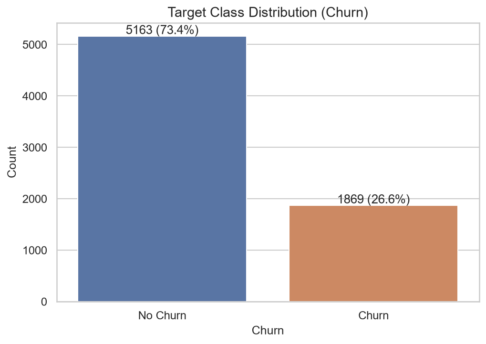

<h3>📊 Histograms</h3>

  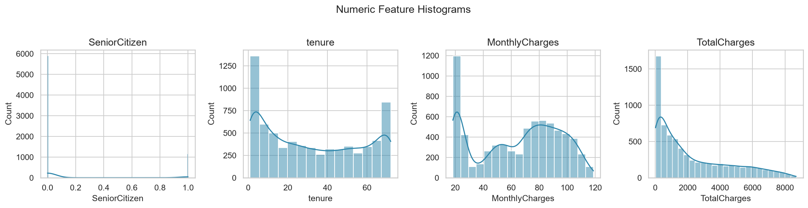

<h3>📦 Boxplots</h3>

  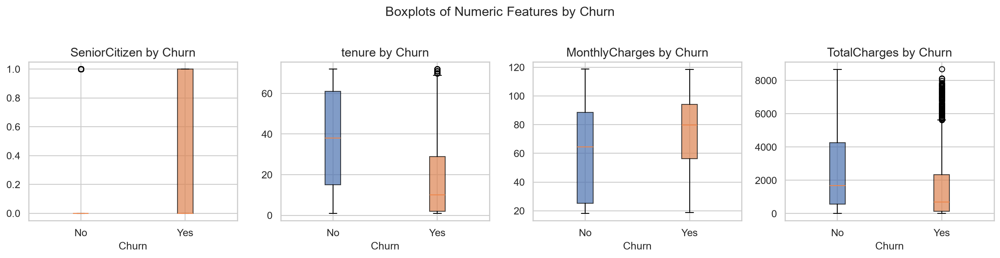

<h3>🔥 Correlation Heatmap</h3>

  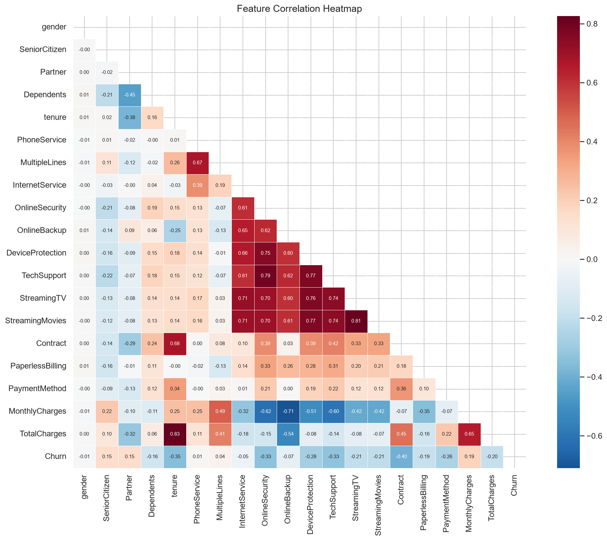

<h3>🔗 Pairplot</h3>

  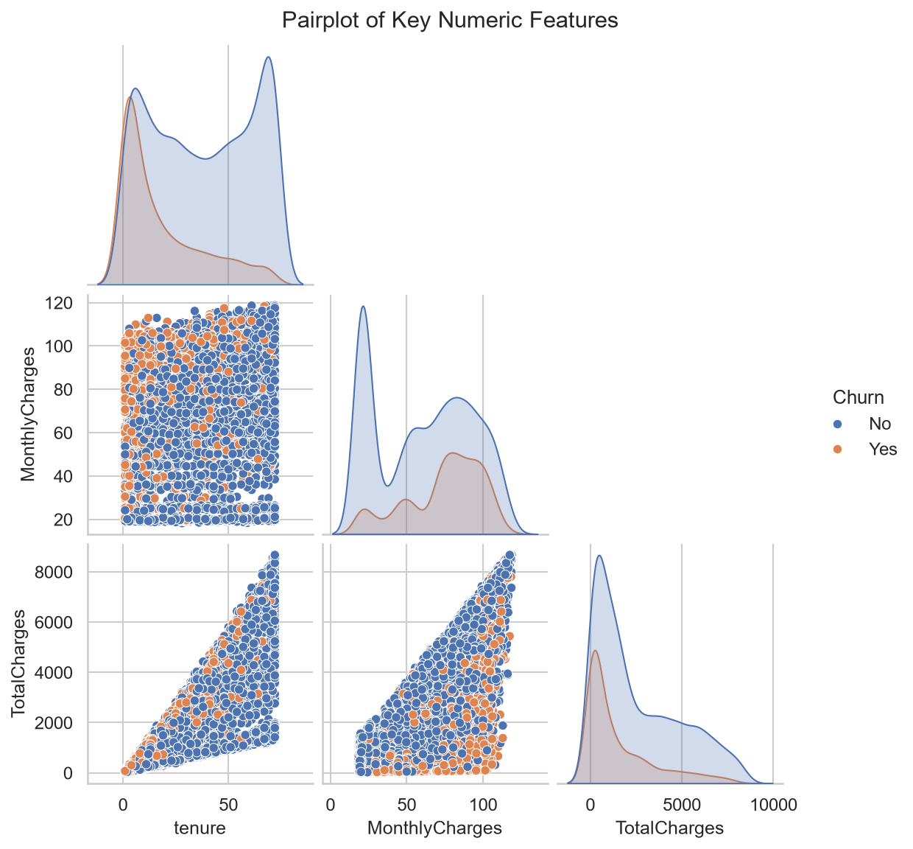

<h3>💰 Monthly Charges vs Churn</h3>

  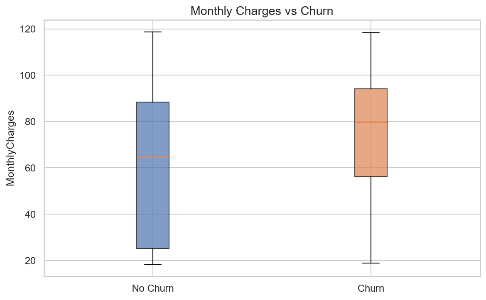

<h3>📄 Contract Type vs Churn</h3>

  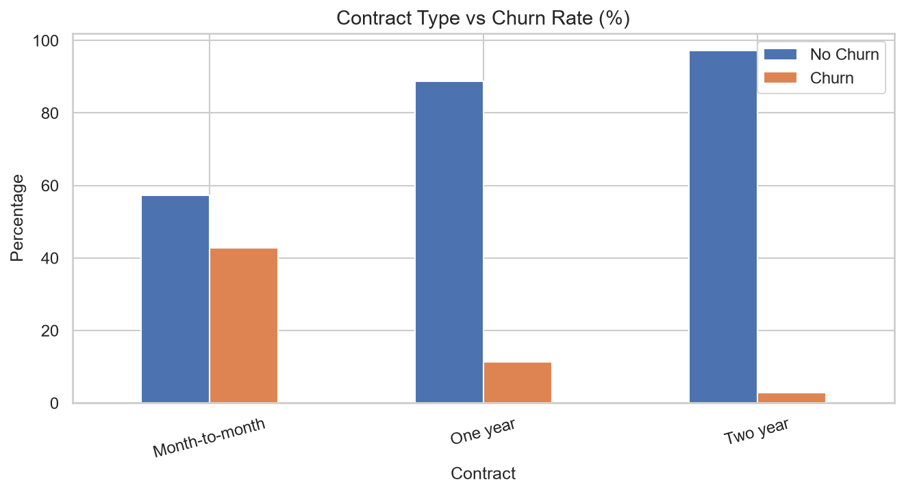

<h3>🌐 Internet Service vs Churn</h3>

  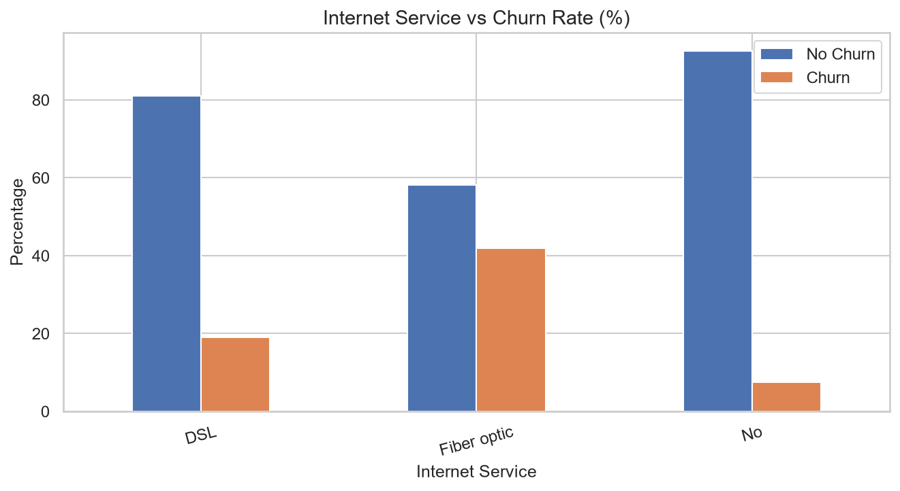

<h3>Customer Churn Model Performance</h3>

  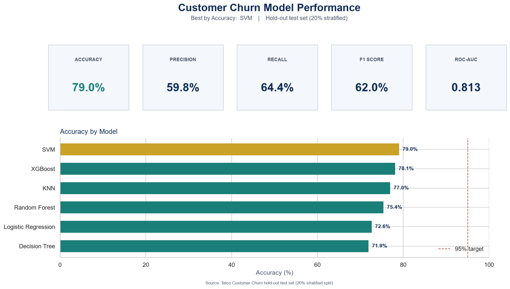

<h3>📈 ROC Curves</h3>

  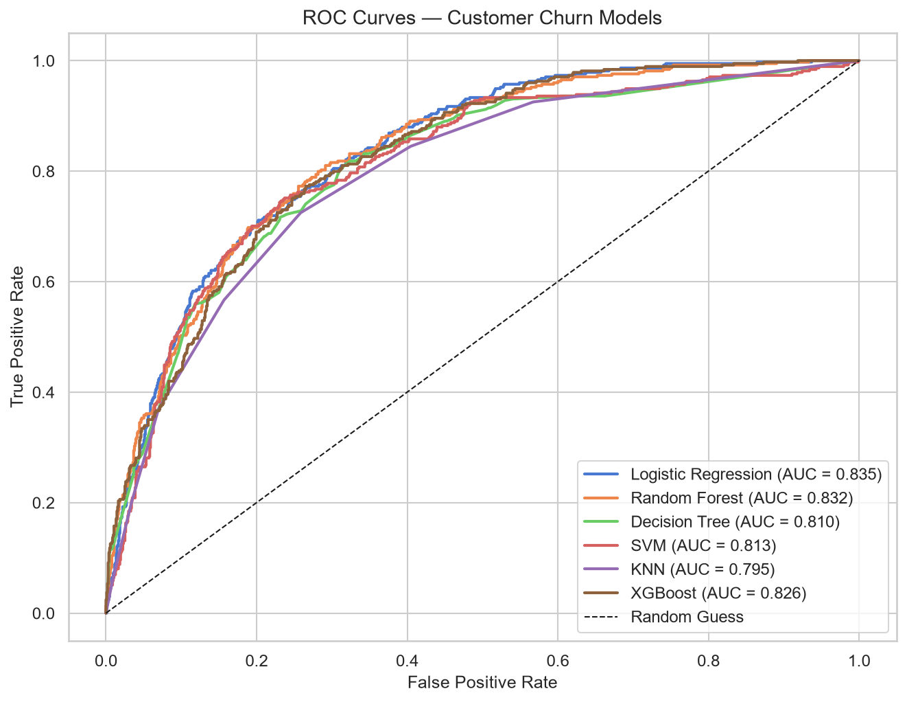

<h3>🧩 Confusion Matrices</h3>

  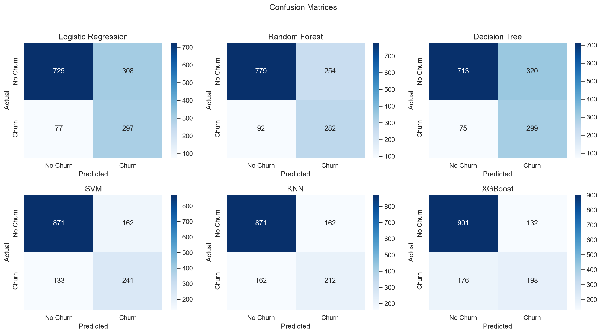

<h3>⭐ Feature Importance</h3>

  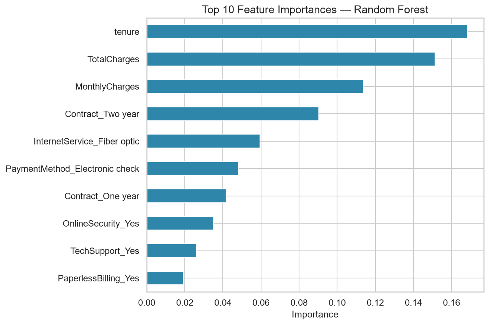

⭐ <b>If you like this project, don't forget to Star the repository!</b>

