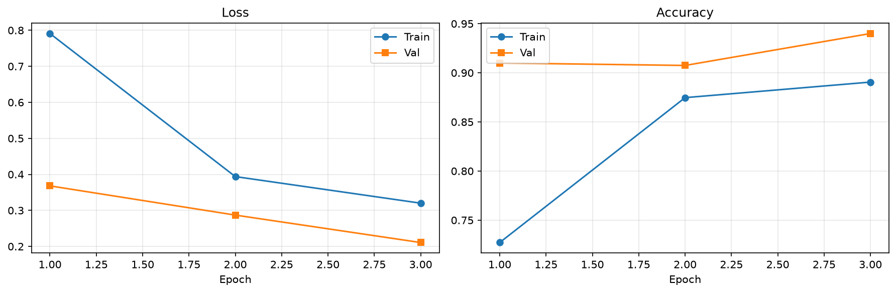
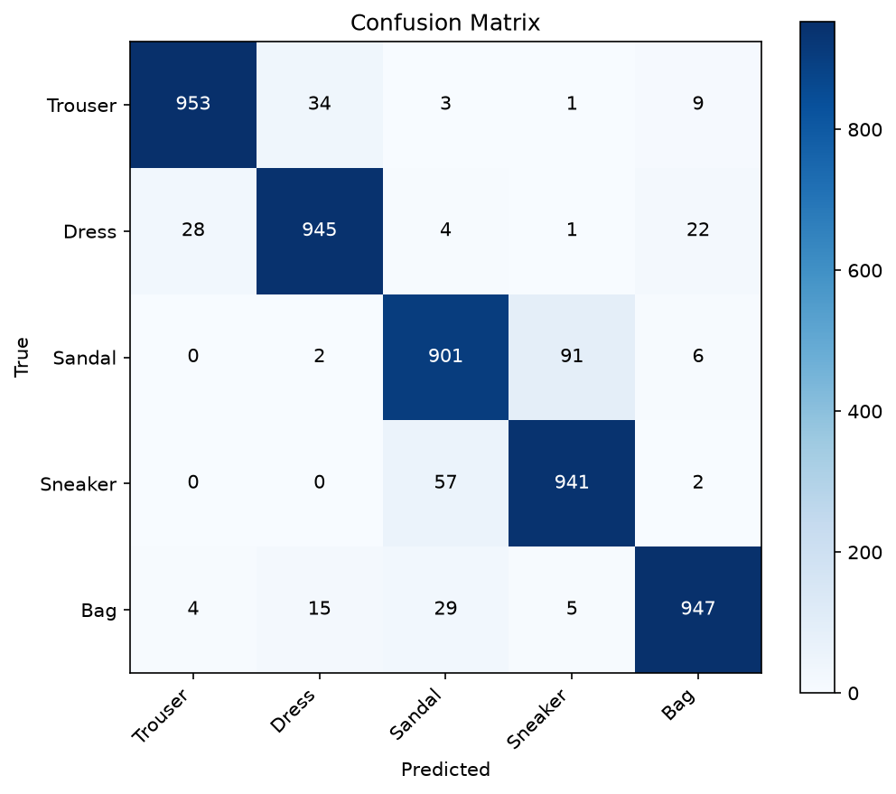

<h3>Cognevance Internship - Task 2</h3>

<h1>👕 Fashion-MNIST Image Classifier</h1>

Classify clothing images using <b>Deep Learning</b> with <b>PyTorch</b> and <b>Transfer Learning</b>.

🧠 Transfer Learning • 🎨 Data Augmentation • 📈 Training Curves • 🤖 Image Classification

<h2>✨ Project Overview</h2>

This project implements an image classification model using a pretrained
<b>ResNet-18</b> network on the <b>Fashion-MNIST</b> dataset. The model uses
transfer learning, data augmentation, and evaluation metrics to classify
different clothing categories.

<h2>🛠️ Technologies</h2>

Python • PyTorch • Torchvision • NumPy • Matplotlib • Scikit-learn • Pillow • Jupyter Notebook

<h2>🎯 Dataset</h2>

<b>Fashion-MNIST</b> contains 70,000 grayscale images (28×28 pixels) across 10 clothing categories.

<ul>
<li>T-Shirt / Top</li>
<li>Trouser</li>
<li>Pullover</li>
<li>Dress</li>
<li>Coat</li>
<li>Sandal</li>
<li>Shirt</li>
<li>Sneaker</li>
<li>Bag</li>
<li>Ankle Boot</li>
</ul>

<h2>🧠 Model</h2>

<ul>
<li>Pretrained ResNet-18</li>
<li>Transfer Learning</li>
<li>Data Augmentation</li>
<li>Adam Optimizer</li>
<li>CrossEntropy Loss</li>
</ul>

<h2>🏆 Model Performance</h2>

<table>
<tr>
<th>Metric</th>
<th>Score</th>
</tr>

<tr>
<td><b>Test Accuracy</b></td>
<td><b>92.9%</b></td>
</tr>

<tr>
<td><b>Validation Accuracy</b></td>
<td><b>93.0%</b></td>
</tr>

<tr>
<td><b>Macro F1 Score</b></td>
<td><b>92.9%</b></td>
</tr>

</table>

<h2>📂 Project Structure</h2>

<pre>
Fashion-MNIST-Image-Classifier/
│
├── data/
├── outputs/
│   ├── best_model.pt
│   ├── training_curves.png
│   ├── confusion_matrix.png
│   ├── metrics.json
│   └── sample_sneaker.png
│
├── train.py
├── inference.py
├── train_image_classifier.ipynb
├── setup.bat
├── train.bat
├── run.bat
├── requirements.txt
└── README.md
</pre>

<h2>▶️ How to Run</h2>

<h3>1️⃣ Install Packages</h3>

<pre>
pip install -r requirements.txt
</pre>

If <code>pip</code> is not recognized:

<pre>
python -m pip install -r requirements.txt
</pre>

<h3>2️⃣ Train the Model</h3>

<pre>
python train.py
</pre>

<b>Or simply run:</b>

<pre>
train.bat
</pre>

<h3>3️⃣ Run Inference</h3>

<pre>
python inference.py --image outputs/sample_sneaker.png --model outputs/best_model.pt
</pre>

<b>Or simply run:</b>

<pre>
run.bat
</pre>

<h3>4️⃣ Open Notebook</h3>

<pre>
python -m notebook train_image_classifier.ipynb
</pre>

In <b>VS Code / Cursor</b>, open
<code>train_image_classifier.ipynb</code>,
select the Python kernel and click <b>Run All</b>.

<h2>📸 Generated Outputs</h2>

<h3>📈 Training Curves</h3>

<h3>🧩 Confusion Matrix</h3>

<h3>📊 Metrics</h3>

Training generates:

<ul>
<li>✔ best_model.pt</li>
<li>✔ training_curves.png</li>
<li>✔ confusion_matrix.png</li>
<li>✔ metrics.json</li>
</ul>

<h3>🖼️ Sample Prediction</h3>

<pre>
Image : sample_sneaker.png

Prediction

👟 Sneaker  → 77.47%
👡 Sandal   → 22.45%
👜 Bag      → 0.05%
</pre>

⭐ <b>If you like this project, don't forget to Star the repository!</b>

