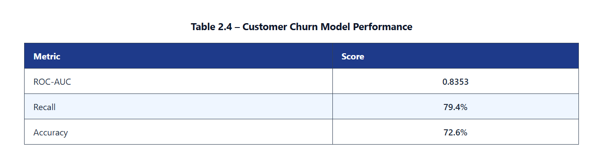
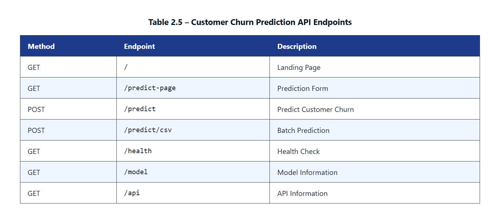
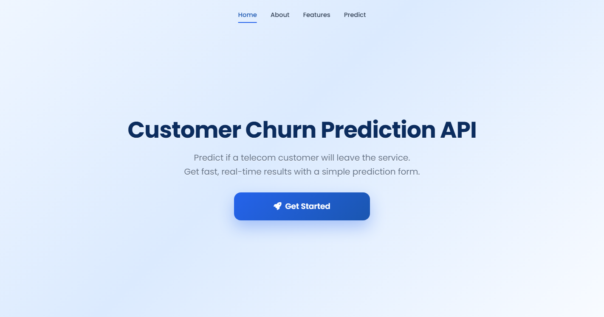
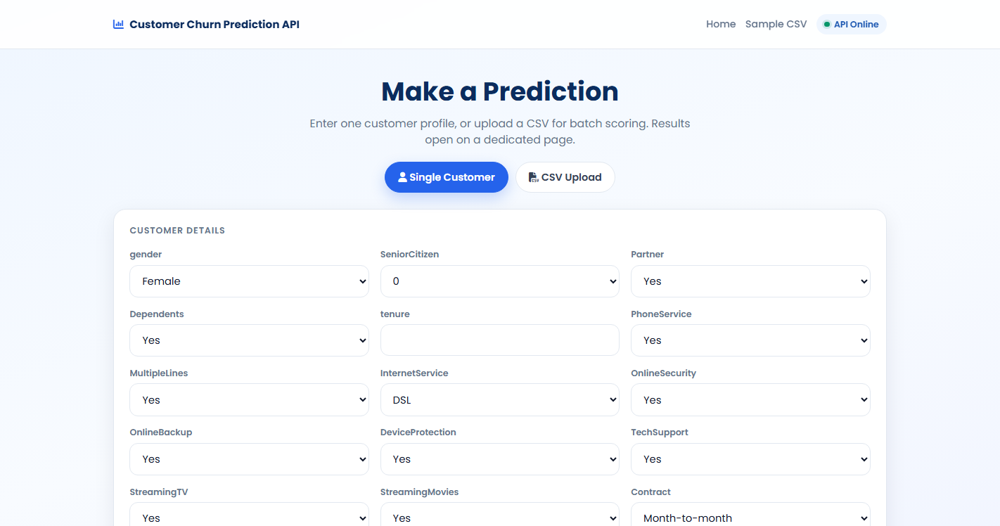
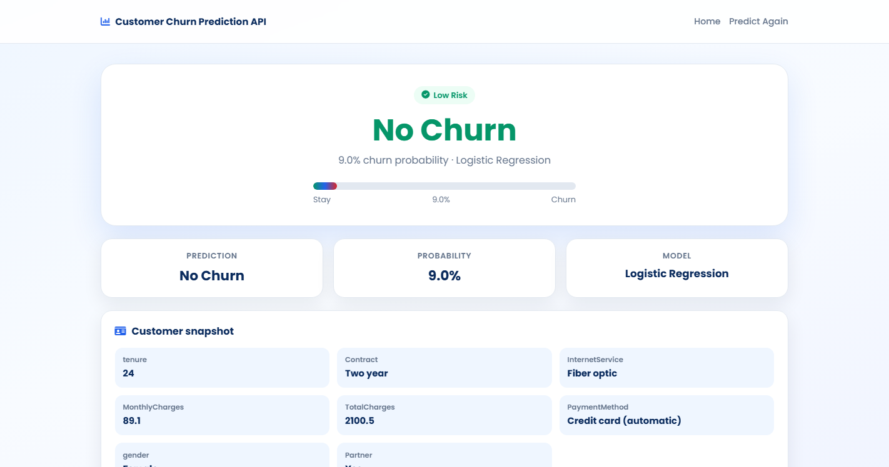
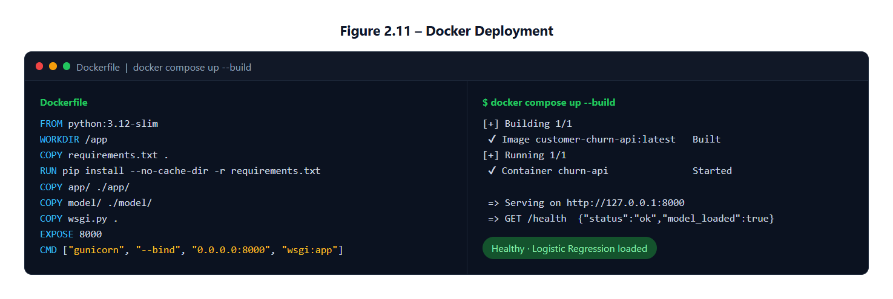

<h3>Cognevance Internship - Task 3</h3>

<h1>🚀 Customer Churn Prediction API</h1>

Deploy a <b>Machine Learning</b> model using <b>Flask REST API</b> to predict customer churn in real time.

🤖 Machine Learning • ⚡ Flask API • 🐳 Docker • 📊 Real-Time Prediction

<h2>✨ Project Overview</h2>

This project deploys the <b>Customer Churn Prediction</b> Machine Learning model as a
<b>Flask REST API</b>. Users can enter customer information through a web interface
or REST API to predict whether a customer is likely to <b>Churn</b> or <b>Stay</b>.

<h2>🛠️ Technologies</h2>

Python • Flask • Scikit-learn • Pandas • NumPy • Joblib • HTML • CSS • Docker

<h2>🎯 Model</h2>

The deployed model is the <b>Logistic Regression</b> classifier trained in
Task 1 using the <b>Telco Customer Churn</b> dataset.

<ul>
<li>Logistic Regression</li>
<li>Data Preprocessing Pipeline</li>
<li>Real-Time Prediction</li>
<li>REST API Deployment</li>
<li>Docker Support</li>
</ul>

<h2>🏆 Model Performance</h2>

<b>Table 2.4 – Customer Churn Model Performance</b>

<h2>📂 Project Structure</h2>

<pre>
Customer-Churn-Prediction-API/
│
├── app/
│   ├── main.py
│   ├── model.py
│   ├── templates/
│   └── static/
│
├── model/
│   ├── best_model.pkl
│   ├── preprocessor.pkl
│   └── metrics.csv
│
├── examples/
│
├── screenshots/
│   ├── home.png
│   ├── predict.png
│   ├── result.png
│   └── docker.png
│
├── requirements.txt
├── Dockerfile
├── docker-compose.yml
├── run.bat
├── wsgi.py
└── README.md
</pre>

<h2>▶️ How to Run</h2>

<h3>1️⃣ Easiest (Windows)</h3>

<pre>
run.bat
</pre>

This creates <code>.venv</code>, installs packages, starts the app, and opens the browser.

<h3>2️⃣ Manual Install</h3>

<pre>
python -m venv .venv
.\.venv\Scripts\Activate.ps1
pip install -r requirements.txt
</pre>

If <code>pip</code> is not recognized:

<pre>
python -m pip install -r requirements.txt
</pre>

<h3>3️⃣ Start the Application</h3>

<pre>
python -m app.main
</pre>

<h3>4️⃣ Open in Browser</h3>

<pre>
http://127.0.0.1:8000
</pre>

<h3>5️⃣ API Documentation</h3>

<pre>
http://127.0.0.1:8000/api
</pre>

<h2>💻 Run on Another Laptop</h2>

<ol>
<li>Zip the project <b>without</b> <code>.venv</code></li>
<li>Unzip on the other laptop</li>
<li>Install Python 3</li>
<li>Run <code>run.bat</code></li>
</ol>

<pre>
.\run.bat
</pre>

<h2>📡 API Endpoints</h2>

<b>Table 2.5 – Customer Churn Prediction API Endpoints</b>

<h2>📸 Generated Outputs</h2>

<h3>Figure 2.8 – Customer Churn Prediction Home Page</h3>

<h3>Figure 2.9 – Customer Prediction Page</h3>

<h3>Figure 2.10 – Customer Prediction Result</h3>

<h3>Figure 2.11 – Docker Deployment</h3>

<h2>📊 Sample Prediction</h2>

<pre>
Customer Prediction

Prediction : No Churn

Probability : 9.0%

Status : Customer is likely to stay (Low Risk).
</pre>

<h2>🐳 Docker</h2>

<pre>
docker compose up --build
</pre>

Then open <code>http://127.0.0.1:8000</code>

⭐ <b>If you like this project, don't forget to Star the repository!</b>

